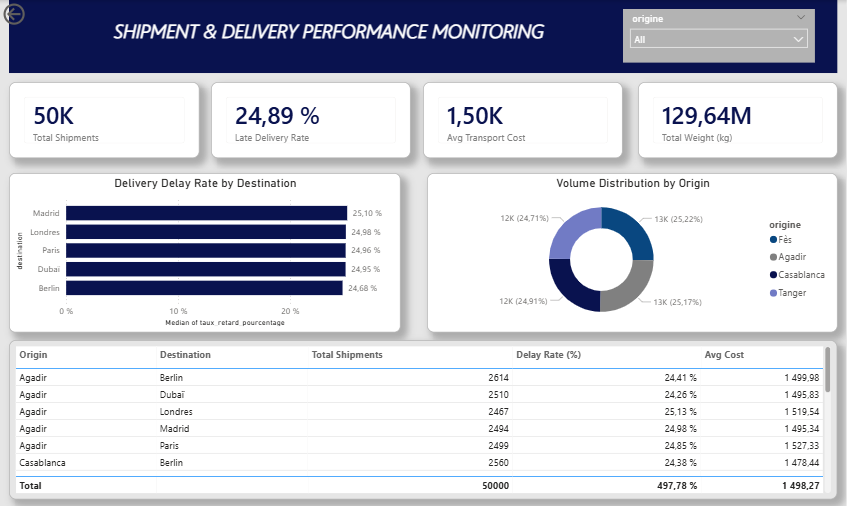

# 🚚 End-to-End Logistics Performance Analysis

## 📌 Project Overview
This project focuses on analyzing supply chain efficiency using a dataset of **50,000 shipments**. The goal was to identify delivery bottlenecks and calculate key performance indicators (KPIs) to optimize transport operations.

## 📊 Key Performance Indicators (KPIs)
Based on the SQL analysis and Power BI visualization:
- **Total Shipments:** 50,000
- **Late Delivery Rate:** 24.33% (Critical area for improvement)
- **Total Transport Cost:** 74.96M €
- **Average Cost per Shipment:** ~1,500€

## 🛠️ Technical Workflow
1. **Data Processing (SQL):** Used PostgreSQL to clean raw data, handle massive inserts, and create views for performance tracking.
2. **Data Visualization (Power BI):** Developed an interactive dashboard to monitor real-time delivery status, weight distribution, and regional performance.
3. **Project Management:** Organized the repository into a professional structure for better collaboration and transparency.

## 📈 Dashboard Preview

## 📁 Repository Structure
- `01_Scripts_SQL`: SQL scripts for database schema and KPI calculations.
- `02_Power_BI`: Power BI Desktop file (.pbix).
- `03_Documentation`: Technical screenshots and visual evidence.

---
*Developed as part of a Logistics Management Portfolio.*
